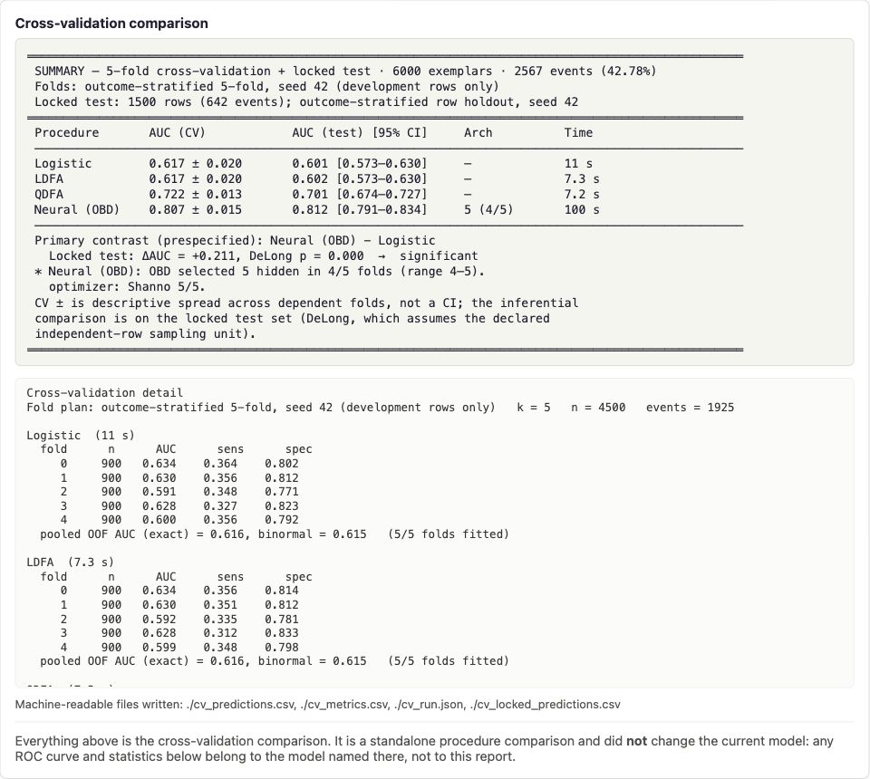

# neuron 3.0

[](https://github.com/craignied/neuron/actions/workflows/ci.yml)

A neural computational modeling environment — the third major revision of **neUROn**,
begun in 1992 by Craig Niederberger.

## History

| Era | Name | Notes |
|---|---|---|
| 1992 | neUROn | Original neural computational environment |
| 1996–2016 | neUROn2++ | Migrated to C++ (1996), fully object-oriented redesign (2000), GNU autotools distribution (2007). Final release 2.6.4 (2016). |
| 2026– | neuron 3.0 | This project — a modern reanimation |

neuron combines feed-forward neural networks with classical statistical models and
serious model evaluation. It is designed for researchers who want to train a model,
understand how it behaves, compare it honestly with alternatives, and preserve enough
evidence to reproduce the analysis.

The current project carries the full neUROn2++ computational engine forward in modern
C++17, restores its deployment path, and adds a local browser interface for the entire
modeling workflow. The original menu interface remains available for scripted and
reproducible sessions.

neUROn and neUROn2++ were used extensively in medical research, particularly for
prediction models in urology and reproductive medicine. neuron 3.0 retains that
research orientation: statistical output is part of the model, not an afterthought.

## What neuron does

### Models

- Feed-forward neural networks: SimpleProp, BareProp, and general BackProp
- Binary logistic regression
- Linear and quadratic discriminant function analysis
- Stepwise input selection for trained networks
- Automatic hidden-layer sizing by Optimal Brain Damage (OBD)

### Training

- Canonical gradient descent, conjugate gradient descent, and Shanno's algorithm
- Automatic optimizer selection by short, reproducible probes
- Batch/epoch and per-exemplar training where mathematically appropriate
- Learning-rate control, weight decay, configurable stopping conditions, and
  plateau-based automatic stopping
- Asynchronous GUI training with a live error chart and graceful cancellation
- Seeded weight initialization and data splitting

### Evaluation

- Classification tables, accuracy, sensitivity, specificity, and predictive values
- Exact empirical ROC area and fitted binormal ROC area
- 95% confidence intervals and goodness-of-fit diagnostics
- Logistic coefficient estimates, Wald tests, and information-matrix condition number
- Outcome-stratified, covariate-stratified, group-aware, and three-way
  train/validation/test splits
- Shared-fold cross-validation across logistic regression, LDFA, QDFA, and neural
  procedures
- Outcome-stratified, covariate-stratified, or group-disjoint cross-validation folds
- Nested OBD inside cross-validation, including group-disjoint inner validation
- Optional untouched locked-test evaluation with paired empirical AUC comparison
- Ordinary DeLong inference for declared independent rows and Obuchowski clustered
  inference for declared sampling-unit clusters
- Auditable prediction, metric, configuration, and action-log artifacts

### Deployment

A trained model can be exported as a single self-contained HTML calculator. The form,
scaling rules, weights, and forward pass are all embedded; it can be opened locally,
emailed, or hosted as a static page. Computation stays in the visitor's browser.

## The interface

The GUI is the primary human interface:

```sh
./build/neuron --gui
```

neuron binds an embedded HTTP server to `127.0.0.1` on an available port, prints the
URL, and opens the browser. The page and server are compiled into the binary; there is
no web framework, Node installation, or external service. Use `--no-browser` when you
want the URL without opening a browser automatically.

The GUI covers the full load → configure → train → evaluate → save workflow, including
the complete statistical report, live ROC and training plots, model comparison, OBD,
and session artifacts. Every GUI/API action is recorded with its parameters in
`neuron_actions.log`.

For reproducible automation, the original menu interface remains:

```sh
./build/neuron --seed 42
```

Scripted runs feed one menu response per line through standard input. The menu surface
is frozen but authoritative; every menu capability also has a GUI control and HTTP API
parameter.

## Installation

neuron requires:

- A C++17 compiler
- CMake
- [GNU Scientific Library (GSL)](https://www.gnu.org/software/gsl/)
- Python 3 only for the optional data-preparation and deployment tools

### macOS

```sh
brew install cmake gsl
cmake -B build -DCMAKE_BUILD_TYPE=Release
cmake --build build --parallel
./build/neuron --gui
```

### Ubuntu/Debian

```sh
sudo apt install build-essential cmake libgsl-dev
cmake -B build -DCMAKE_BUILD_TYPE=Release
cmake --build build --parallel
./build/neuron --gui
```

### Windows

Install CMake and GSL—for example, `vcpkg install gsl`—then configure and build with
your CMake generator. The CI workflow in
[`.github/workflows/ci.yml`](.github/workflows/ci.yml) is the tested reference for
Windows setup.

Command-line options:

```text
Usage: neuron [--seed N] [--gui [--no-browser]] [--version]
```

If a source directory was copied or moved with an existing `build/` directory, remove
that build directory before configuring again. CMake caches absolute source paths.

## Start with the illustrated GUI walkthrough

The
**[Civic Choice walkthrough](docs/datasets/civic-choice/WALKTHROUGH.md)**
is the fastest way to see the complete neuron workflow. It uses one reproducible,
explicitly fictional synthetic dataset to show how to:

- prepare mixed numeric and categorical data;
- make an honest training/validation/test split;
- fit and interpret a logistic baseline;
- perform grouped stepwise variable selection;
- size a neural network with validation-guided OBD; and
- compare logistic regression, LDFA, QDFA, and a neural procedure with nested
  cross-validation and an untouched locked test.

[](docs/datasets/civic-choice/WALKTHROUGH.md)

*Civic Choice is fictional synthetic demonstration data. It describes no real
voters or political behavior and is not a tool for political targeting.*

## Architecture and API reference

The **[neuron Design Manifest](https://raw.githubusercontent.com/craignied/neuron/main/docs/manifest.pdf)**
opens directly as a PDF and is the human-readable
reference for the project architecture. It documents:

- the neuron 3.0 layer and ownership model;
- the command-line interface and reproducible scripted sessions;
- the complete loopback REST API, including asynchronous jobs and artifacts;
- the current data-preparation and HTML-deployment helpers; and
- the mathematical and object-design foundations inherited from neUROn2++.

The current neuron 3.0 material appears first; the retained historical
mathematics and class design are clearly labeled as the foundational design
record.

## Data and experiment files

The engine works with numeric datasets whose outcome is the final column. The
standard-library-only [`tools/mkdataset.py`](tools/mkdataset.py) utility converts
ordinary CSV exports into that form:

- alternate delimiters;
- categorical and binary text values;
- reference-category one-hot coding;
- missing-value indicator pairs;
- key files mapping numeric columns back to variables; and
- grouped input definitions for stepwise analysis.

The GUI can load a raw dataset and make a split, or load an existing training/test
pair. A good practice is to launch neuron from one directory per experiment: uploaded
data, network and scaling files, reports, predictions, and the timestamped action log
then remain together.

`--seed N` controls weight initialization, splits, resampling, and other stochastic
operations. The generator is `std::mt19937`; its stream is specified by the C++
standard. The repository's seeded golden transcripts reproduce across macOS, Linux,
and Windows.

## Statistical interpretation

neuron reports two complementary ROC areas:

- **Binormal \(A_z\)** fits the ROC in z-space following Wickens' signal-detection
  formulation. Its percentile 95% confidence interval is obtained by stratified
  case bootstrap.
- **Empirical AUC** is the exact non-parametric Mann–Whitney area over the observed
  scores. Its Hanley–McNeil interval provides an independent cross-check.

The report states the number of fitted operating points and bootstrap resamples. It
also includes Kolmogorov–Smirnov, Pearson, and Hosmer–Lemeshow diagnostics where
appropriate. Continuous-score binormal fit probabilities should not be read as proof
of a perfect model; [`docs/roc_theory.md`](docs/roc_theory.md) explains the estimands,
assumptions, implementation, citations, and recommended reporting language.

Cross-validation summaries are descriptive: folds share training observations, so
fold-to-fold variation is not a confidence interval. Formal paired empirical-AUC
comparison is available on an untouched locked test. Declaring
`independence=rows` selects ordinary DeLong inference for genuinely independent rows;
declaring `independence=cluster` with a `group=` key selects Obuchowski's clustered
ROC covariance. A mechanical row split does not establish independence, and neuron
never substitutes one estimator for the other.

Group-aware splitting and cluster-aware inference solve different problems. Keeping a
group wholly on one side prevents train/test leakage and measures generalization to
unseen groups; it does not make rows within a held-out group independent. Clustered
inference changes the covariance estimate while leaving the patient-row empirical AUC
unchanged. Depending on the within-cluster covariance, the row-based standard error can
be too small or too large.

## Model comparison and data splitting

The default raw split is stratified on the binary outcome. Optional covariate
stratification can improve subgroup coverage in smaller datasets, but it should be a
deliberate choice: forcing the test set to resemble the training set may hide
covariate drift.

Group-aware splitting keeps all rows sharing selected group values on one side—for
example, all patients from a site or county. This is the appropriate design when the
question is performance on entirely unseen groups. A validation split can additionally
reserve model-selection data so the final test remains untouched.

The cross-validation comparison runs selected procedures over one shared fold plan,
producing paired out-of-fold predictions. By default the folds are outcome-stratified.
`strata=` adds selected covariates to the balancing cells; `group=` instead keeps every
cluster intact and uses the same group key for the locked holdout and nested OBD's inner
validation split. The two policies are currently alternatives, not a combined mode.
Procedure-specific deterministic RNG substreams make a procedure's result invariant to
which other procedures are included or how they are ordered.

Tiered output keeps the headline comparison readable while preserving the substrate:

- a compact summary and prespecified contrast;
- per-fold metrics and failures; and
- CSV/JSON predictions, metrics, configuration, architecture, and provenance.

## Standalone model deployment

[`tools/neuron2web.py`](tools/neuron2web.py) combines:

1. a saved network;
2. the training-data scaling factors; and
3. a human-readable label specification.

It validates that the specification matches the model and can evaluate a known row
before export. The resulting HTML contains no external scripts or runtime dependency.
See [`docs/deploy.md`](docs/deploy.md) for the label format and deployment contract.

The Python tools use only the standard library. They run with a bare `python3`; no
virtual environment or package installation is required.

## Verification

Every push is built and tested on macOS, Linux, and Windows by GitHub Actions.

```sh
cmake --build build --parallel
ctest --test-dir build --output-on-failure
./tests/golden/run_golden.sh
./tests/tools/run_tools.sh
./tests/gui/smoke.sh
./tests/gui/asyncjob.sh
```

The verification layers include:

- unit and subsystem tests for matrix operations, splitting, training, ROC statistics,
  goodness of fit, OBD, cross-validation, ordinary DeLong covariance, and Obuchowski
  clustered covariance;
- three seeded end-to-end golden sessions whose transcripts must remain
  byte-identical apart from elapsed time;
- explicit coverage assertions ensuring the goldens actually execute the statistical
  paths they claim to protect;
- a full GUI/API smoke suite;
- a separate suite for the asynchronous-job lifecycle every long operation shares —
  the single-owner gate, cancellation, and the ordering that publishes a result before
  a job reports itself finished, the last of which is pinned in-process because it is
  not observable across a network; and
- a local oracle harness that builds the final neUROn2++ release and compares shared
  numerical paths with neuron 3.0.

Tests for new behavior are required to fail against the behavior they guard before
they are trusted. This rule exists because a green test suite once failed to execute
an entire replaced ROC confidence-interval path.

## Project map

| Path | Contents |
|---|---|
| [`src/`](src/) | C++ engine, statistical models, evaluation, embedded server, and GUI |
| [`tools/`](tools/) | Standard-library Python tools for data grooming and HTML deployment |
| [`tests/`](tests/) | Unit, golden, GUI, tool, and legacy-oracle verification |
| [`docs/`](docs/) | Statistical theory, deployment reference, evaluation design, legacy manual, and datasets |
| [`third_party/`](third_party/) | Vendored lightweight dependencies |
| [`AGENTS.md`](AGENTS.md) | Operational recipes and repository rules for AI assistants |
| [`CLAUDE.md`](CLAUDE.md) | Standing rules, current state, settled decisions, and active roadmap |
| [`docs/HISTORY.md`](docs/HISTORY.md) | Dated development record and completed roadmaps |

## Current status

neuron reports version `3.0.0-dev`. The complete neUROn2++ engine has been carried
forward and made C++17-clean. The current code builds without warnings, preserves
legacy numerical behavior on shared paths through the oracle comparison, and pins
intentional corrections with regression tests.

The primary interface is now the embedded GUI, while the menu interface remains
available for automation and compatibility. Data grooming, model deployment, modern
ROC intervals, scalable splitting, validation-aware OBD, cross-validation comparison,
group-disjoint evaluation, clustered locked-test inference, and auditable experiment
artifacts are implemented.

A structural review of the engine, conducted against the project's layer-ownership
rules, is complete. It consolidated duplicated mechanisms into the classes that own
them, made the numerical layer refuse invalid arguments in release builds rather than
only under assertions, and fixed fourteen defects inherited from the legacy code —
each recorded with the measurement that proved it. Two of its items concluded, on
measurement, that no change was warranted.
The standing rules, current state, and remaining roadmap live in
[`CLAUDE.md`](CLAUDE.md); the dated development record is
[`docs/HISTORY.md`](docs/HISTORY.md).

Contributions should preserve the project's central contract: one authoritative
implementation of each mechanism, reproducible analysis, GUI/CLI parity, and
statistical claims no stronger than the design supports.
