# Civic Choice: a complete GUI model-comparison walkthrough

This walkthrough uses neuron’s GUI to fit an interpretable baseline, inspect
grouped variable evidence, size a nonlinear neural network, and compare four
procedures on an untouched locked test set.

> **Important:** Civic Choice is fictional, synthetic demonstration data. It
> describes no real voters, parties, demographic behavior, or voting patterns.
> The results are not evidence about real people and must not be used for
> political targeting. The transparent generator and data notes are in this
> directory’s [README](README.md).

The screenshots and reported values come from one run of the committed
6,000-row dataset: data-generation seed `20260724`, split/training seed `42`,
and neuron `3.0.0-dev` at commit `52bd30f`.

## 1. Prepare a clean experiment folder

Run these commands from the neuron repository root. The experiment is kept on
the Desktop so its generated data, logs, models, predictions, and reports are
easy to find and do not clutter the source tree.

### macOS or Linux

Open Terminal and paste these commands at the existing zsh or bash prompt:

```bash
Walkthrough="$HOME/Desktop/neuron-civic-choice-walkthrough"
mkdir -p "$Walkthrough"
cp build/neuron "$Walkthrough/neuron"
cp tools/mkdataset.py tools/neuron2web.py "$Walkthrough/"
cp docs/datasets/civic-choice/civic_choice.csv "$Walkthrough/"
cd "$Walkthrough"
```

If the Desktop is redirected on your system, replace the first path with its
actual location.

### Windows PowerShell

Open PowerShell in the repository root. An MSVC build normally places the
executable under `build\Release`; a single-configuration build may use
`build\neuron.exe`.

```powershell
$Desktop = [Environment]::GetFolderPath("Desktop")
$Walkthrough = Join-Path $Desktop "neuron-civic-choice-walkthrough"
New-Item -ItemType Directory -Force $Walkthrough | Out-Null
$Neuron = if (Test-Path "build\Release\neuron.exe") {
    "build\Release\neuron.exe"
} else {
    "build\neuron.exe"
}
Copy-Item $Neuron (Join-Path $Walkthrough "neuron.exe")
Copy-Item "tools\mkdataset.py","tools\neuron2web.py" $Walkthrough
Copy-Item "docs\datasets\civic-choice\civic_choice.csv" $Walkthrough
Set-Location $Walkthrough
```

## 2. Groom the mixed CSV

The source CSV contains named categorical values. Convert them to numeric input
nodes, keep one reference level per category so an intercept is identifiable,
and write both a column key and a grouped-variable definition:

macOS/Linux:

```bash
python3 mkdataset.py --onehot --refcat \
  --key civic_key.txt --inputs civic_inputs.txt \
  -o civic_data.txt civic_choice.csv
```

Windows PowerShell:

```powershell
py -3 .\mkdataset.py --onehot --refcat `
  --key civic_key.txt --inputs civic_inputs.txt `
  -o civic_data.txt civic_choice.csv
```

The final line should say there are 15 numeric columns, hence **14 input
nodes** and one outcome. Read `civic_key.txt` before modeling. It is the audit
trail from human variables to encoded nodes; `civic_inputs.txt` preserves which
indicator nodes belong to one conceptual variable.

## 3. Start the GUI and make an honest three-way split

Start neuron from the experiment folder:

macOS/Linux:

```bash
./neuron --gui
```

Windows PowerShell:

```powershell
.\neuron.exe --gui
```

The terminal owns the live engine session. Leave it open. The browser page does
not currently reconstruct completed display state after it is closed and
reopened, so save important files promptly.

Before entering fractions, keep the three roles distinct:

- **Training** rows fit weights and coefficients.
- **Validation** rows guide choices such as OBD hidden-node sizing.
- **Test** rows remain untouched until final evaluation.

Choose `civic_data.txt`, leave the mode at **raw data → split**, set **Test
fraction** to `0.25`, set **Validation fraction** to `0.25`, and click **Load
dataset** at the bottom of the panel.

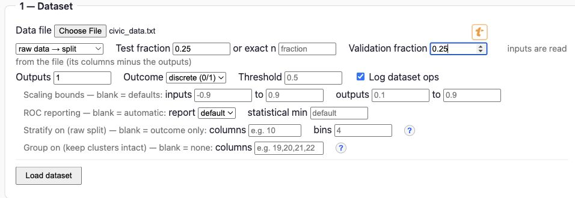

*A three-way outcome-stratified split is configured before loading.*

The completion message must report **3,000 training**, **1,500 validation**, and
**1,500 test** exemplars. Stop and correct the split if it does not.

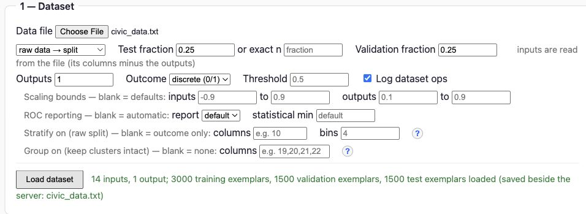

*The load message is the split audit; acknowledge it before modeling.*

## 4. Fit the logistic baseline

In **2 — Model**, choose **Binary logistic regression** and click **Create
model**. Logistic regression is a useful interpretable baseline, but its
main-effects form cannot express Civic Choice’s U-shaped age effect,
middle-versus-tail income effect, or marital-status × home-ownership reversal.

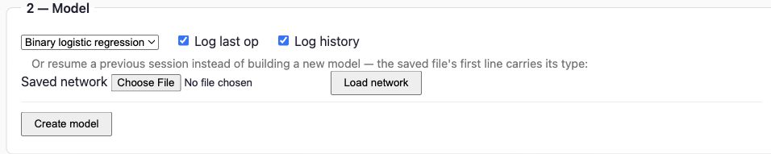

*The action follows all model choices.*

In **3 — Train**, use:

- Canonical backpropagation
- Maximum iterations `20000`
- Seed `42`
- Maximum gradient `1e-6`

Then click **Train**. The 20,000 iterations are a **safety ceiling**, not a
claim of convergence. A valid fit needs an actual stopping condition to fire;
reaching only the ceiling means the operation finished but the fit did not
converge.

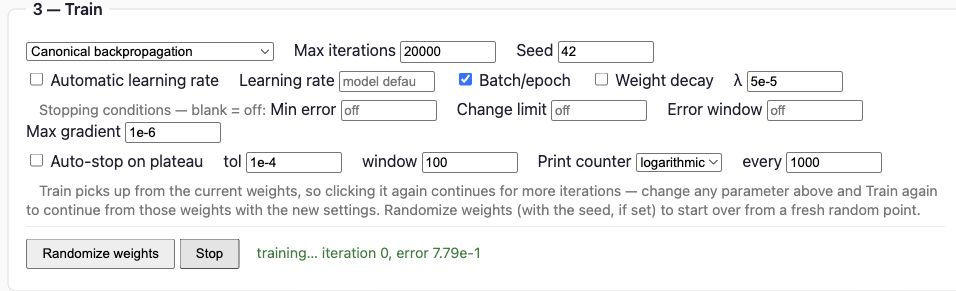

*Live progress shows the current iteration and error; it is not yet a result.*

The three-way run’s untouched-test ROC area is about **0.594**, close to chance
but measurably above it; training ROC is about **0.622**. Accuracy near 60%
does not establish a strong classifier, and should never replace ROC,
sensitivity, and specificity in the interpretation.

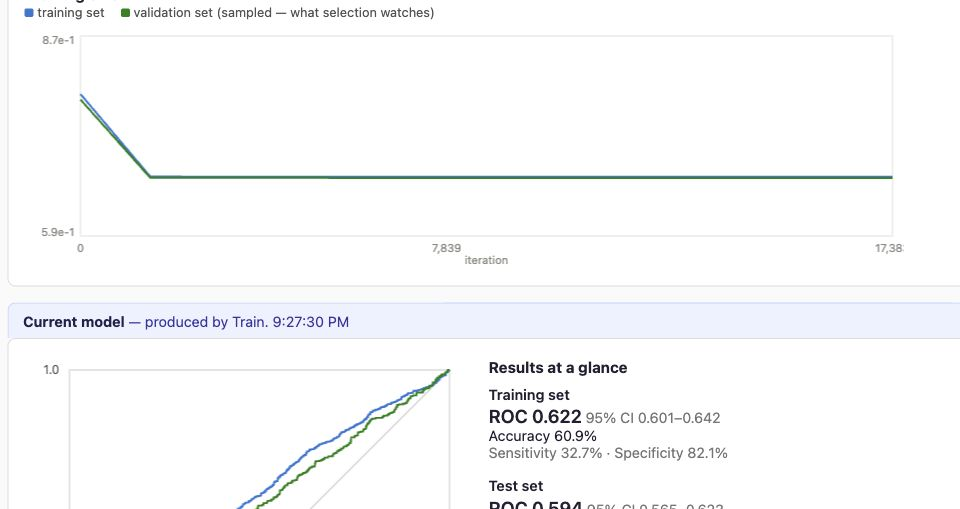

*The held-out result is modest, as expected for a linear main-effects model on
this nonlinear problem.*

## 5. Inspect grouped variable evidence

Wald rows in the logistic report test individual encoded coefficients. They do
not remove conceptual variables, and several indicator coefficients may belong
to one variable. The Stepwise panel refits grouped subnetworks instead.

Paste this structure from `civic_inputs.txt`:

```text
0;1;2-5;6-8;9;10;11;12;13
```

Choose **reverse**, keep the threshold at `0.05`, and click **Run regression**.
The original trained model is not changed.

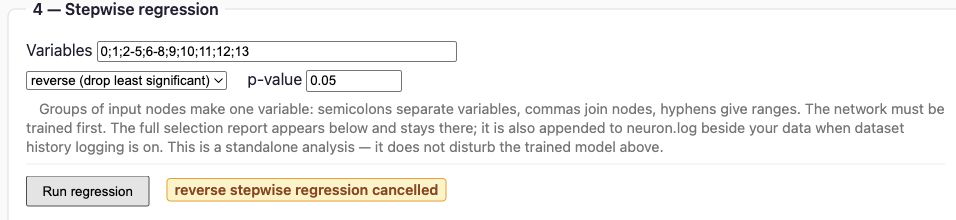

*A multi-fit procedure exposes what it is evaluating and remains stoppable.*

In this run the final retained groups were `0, 1, 3, 8`: age, income,
education, and home ownership. Ethnicity, preferred ice cream, and car
ownership—the deliberately null variables—were removed. Employment and marital
status were also removed from this main-effects logistic selection; that is not
a claim that they have no role in the nonlinear data-generating mechanism.
Stepwise p-values are model-dependent evidence, not causal proof.

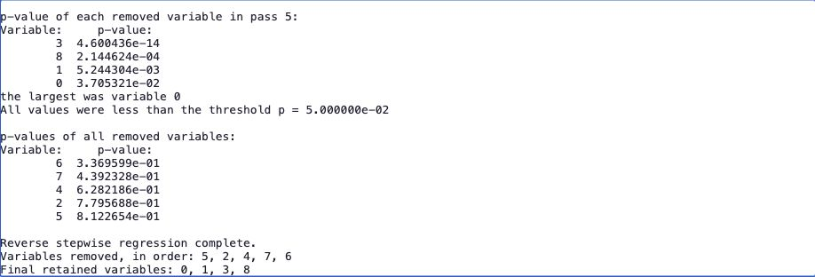

*Read the explicit final summary; do not infer the retained set from a partial
audit.*

## 6. Size one neural hidden layer with OBD

Create a **Neural network** with five hidden nodes. Then configure **4c — OBD
hidden-layer sizing**:

- Starting hidden nodes `2`
- Maximum hidden nodes `12`
- Iteration budget `6000`
- Algorithm **Auto — probe once, keep the choice**
- Seed `42`

The budget is per attempted size and remains a safety ceiling. OBD sizes the
number of nodes in **one** hidden layer; it does not add layers.

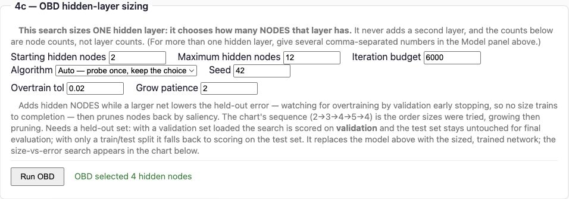

*The controls name hidden nodes explicitly and the Run action comes last.*

Click **Run OBD**. Auto first probes the optimizers, then OBD grows and prunes
candidate node counts. The live status names the phase and node count.

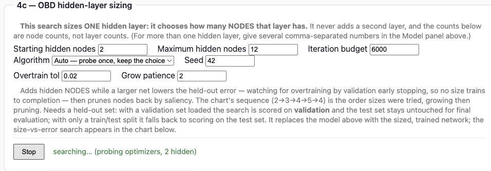

*Optimizer probing is a real phase, not a hung search.*

This seeded run selected **four hidden nodes**. The validation error is the
score used for architecture selection; the test set remains untouched for the
final model evaluation.

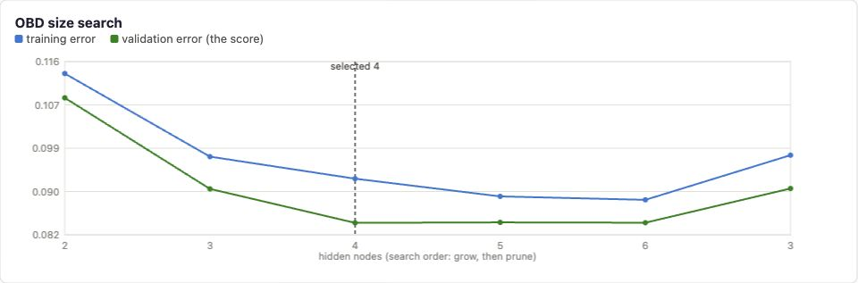

*The sequence is search order, not a stack of hidden layers.*

The selected current model achieved test ROC about **0.807**, far above the
logistic baseline. Its provenance banner says it was produced by standalone
OBD and names the four-node architecture.

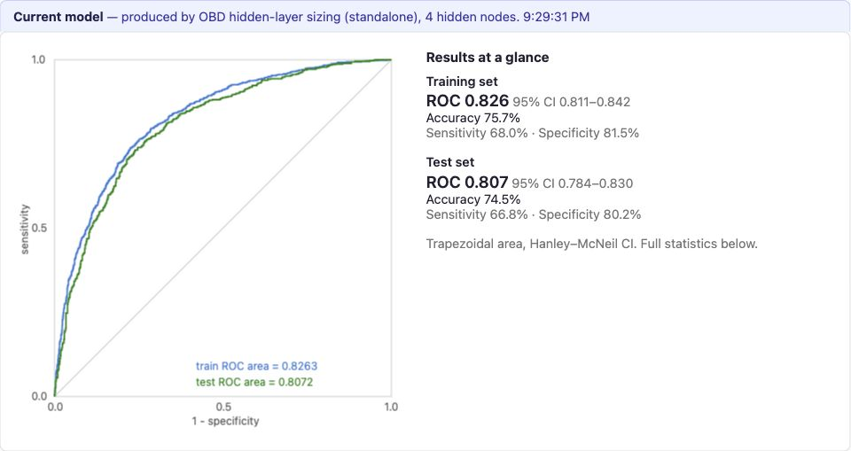

*Validation selected the architecture; the untouched test estimates its final
performance.*

## 7. Compare four procedures with nested CV and a locked test

One favorable split is not enough. Configure **4d — Cross-validation model
comparison**:

- 5 folds; seed `42`; maximum iterations `20000`
- Logistic, LDFA, QDFA, and Neural network
- Neural **with nested OBD**
- OBD maximum hidden nodes `12`
- OBD iteration budget `20000`
- Inner validation `0.25`
- OBD optimizer **Auto**
- Locked-test fraction `0.25`
- Primary **neural** minus Reference **logistic**
- Sampling unit **independent rows (IID) — run DeLong**

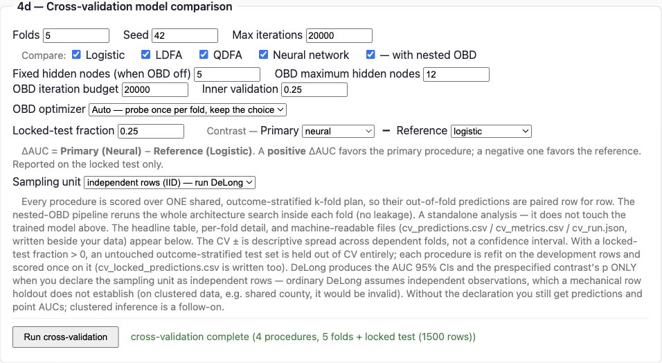

*The subtraction direction and its interpretation remain visible.*

The independent-row choice is an **analyst declaration required for ordinary
DeLong inference**. Neuron did not infer independence from the file. Repeated
people, households, sites, or other clusters would require a group-aware design
and `independence=cluster`, which uses Obuchowski's clustered ROC covariance,
instead.

Click **Run cross-validation**. Nested OBD runs independently inside each outer
fold, preventing validation information from leaking across folds. The live
status identifies the procedure, fold, completed folds, nested phase, and
hidden-node trial.

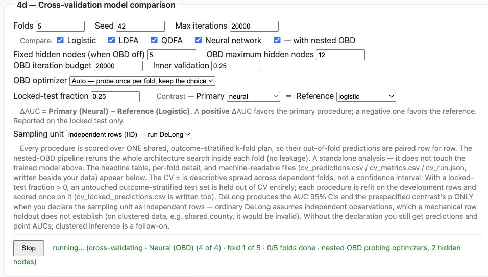

*The long comparison exposes its nested work and remains stoppable.*

## 8. Interpret the locked-test comparison

The completed headline is:

| Procedure | CV AUC | Locked-test AUC (95% CI) |
|---|---:|---:|
| Logistic | 0.617 ± 0.020 | 0.601 (0.573–0.630) |
| LDFA | 0.617 ± 0.020 | 0.602 (0.573–0.630) |
| QDFA | 0.722 ± 0.013 | 0.701 (0.674–0.727) |
| Neural (nested OBD) | 0.807 ± 0.015 | 0.812 (0.791–0.834) |

The prespecified locked-test contrast is **Neural − Logistic = +0.211**,
ordinary DeLong `p < 0.001` (the GUI prints `0.000`). A positive difference
favors the primary neural procedure. OBD selected five nodes in four of five
folds and four nodes in the other; Auto selected Shanno independently in all
five folds.


*The CV spread is descriptive across dependent folds; inference comes from the
prespecified paired comparison on the untouched locked test.*

The detail correctly reports **4,500 development rows with 1,925 events** and
**1,500 locked-test rows with 642 events**, totaling the original 6,000 rows
and 2,567 events.

Cross-validation is a standalone comparison. It does not replace the model
currently loaded in neuron. The boundary note and provenance banner prevent the
standalone OBD ROC panel below from being mistaken for a CV result.

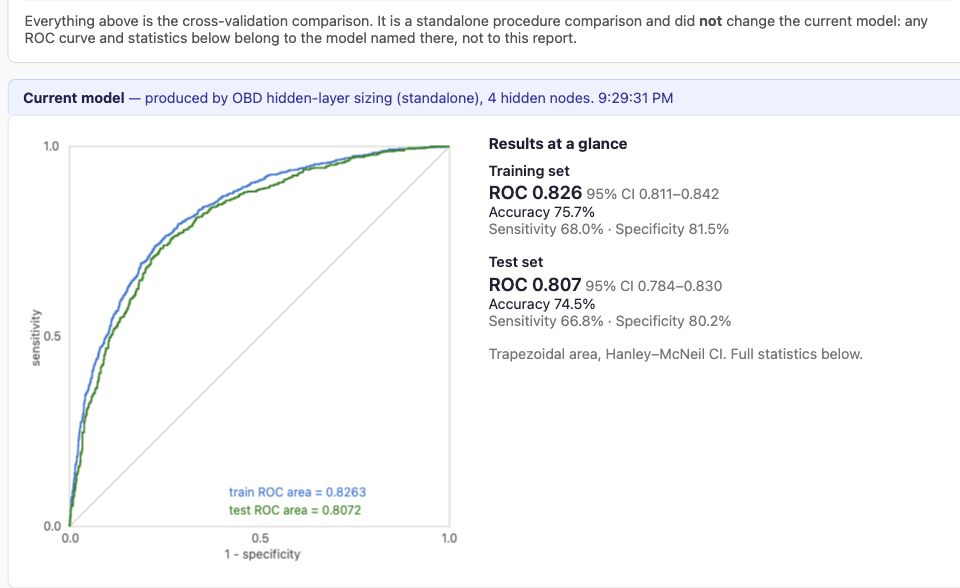

*The current model remains the four-node standalone OBD network; the comparison
above is separate.*

## 9. Save the audit trail

The **Session files** panel writes files into the experiment directory and also
downloads them through the browser. Save at least the network, scaling factors,
report, and relevant predictions. Keep `neuron_actions.log`, `neuron.log`,
`cv_metrics.csv`, `cv_predictions.csv`, `cv_locked_predictions.csv`, and
`cv_run.json` with the experiment.

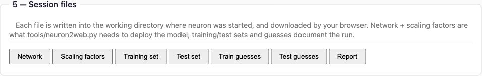

*Save artifacts while the engine session is still open.*

`cv_run.json` is the machine-readable record of the split, procedures,
architectures, convergence, and locked-test inference. The CSV prediction files
make downstream checking possible without rerunning the models.

## What this example establishes

The exercise does not establish anything about real voters. It establishes that
on a transparent synthetic nonlinear problem:

1. a main-effects logistic baseline is interpretable but structurally limited;
2. grouped stepwise evidence can discard deliberately null variables without
   being mistaken for causal truth;
3. validation-guided OBD can size a compact neural architecture without tuning
   on the final test set; and
4. the nonlinear advantage survives nested selection and one prespecified,
   paired comparison on an untouched locked test.
